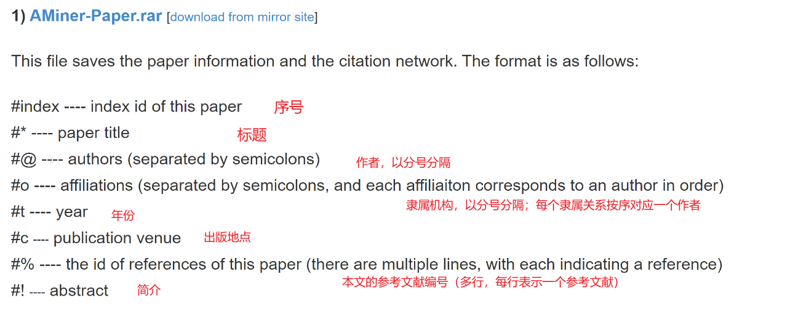
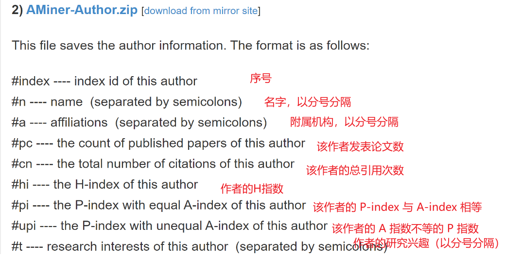
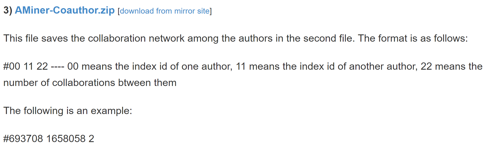
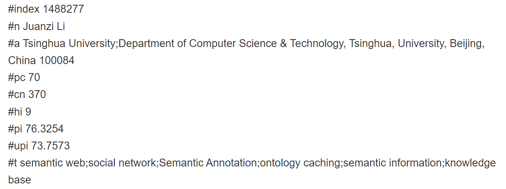
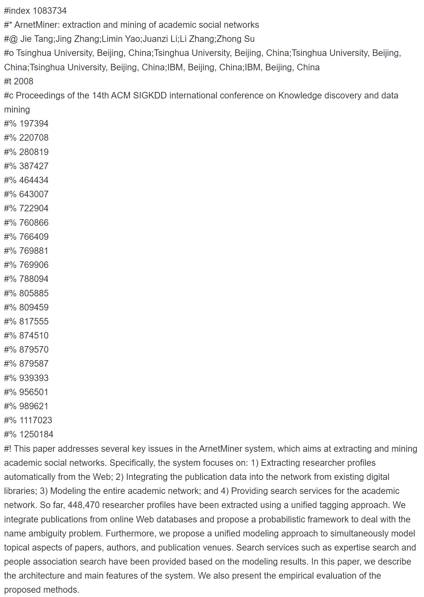
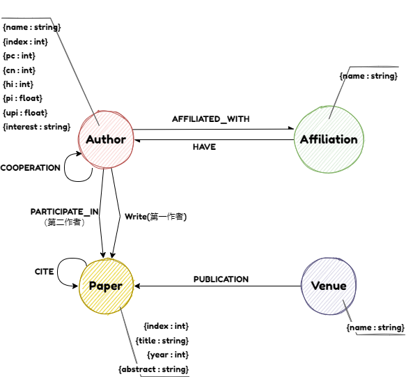

# 项目结构

## ETL脚本

在./ETL中

## 相关资料

在./资料中

### 源文件的各个字段解释







### 示例

#### author



#### paper



### 图数据库各个字段




>  由于服务器没这么大空间，并且传文件实在太慢了，就不放在服务器上了，就本地跑一下

# 安装neo4j

> https://www.cnblogs.com/caoyusang/p/13610408.html

## 安装neo4j desktop

https://neo4j.com/download/

傻瓜式安装

### 创建数据库


### 输入对应账号密码


### 启动


如果你的端口被占用，会弹出以下信息


按fix configuration


## 通过docker安装（废弃）

### 安装最新版neo4j

```shell
docker pull neo4j
```


### 查看本地镜像

```shell
docker images
```

### 构建容器

```shell
docker run -d --name neo4j -p 7474:7474 -p 7687:7687 -v /home/neo4j/data:/data -v /home/neo4j/logs:/logs -v /home/neo4j/conf:/var/lib/neo4j/conf -v /home/neo4j/import:/var/lib/neo4j/import --env NEO4J_AUTH=neo4j/password neo4j
```

如果端口被占用，则调整这两个地方


账户密码


### 查看构建情况

```shell
docker ps
```


现在就安装好neo4j了


# 数据处理

## `resources.yml`

首先需要配置数据源信息

项目根目录下有`resources_template.yml`，请更名为`resources.yml`并完善相关信息


## 运行项目

### 安装相关依赖

- `python3.8`
- `pandas`
- `yaml`
- `fileinput`

## 运行

首先先到根目录

然后，进入etl

```
cd ETL
```

运行

```
python main.py
```

运行结束之后，在yml中设置的路径下就会生成对应的文件


# 导入数据

## neo4j desktop

### setting

编辑配置


#### java堆大小设置

我在运行的时候最大堆大小设置为8g会报错，16g可以使用


#### 允许使用csv设置


### 运行cypher-shell


#### 命令

```
cd bin
```

```
cypher-shell.bat -a neo4j://localhost:<your-port>
```


然后输入你之前设置的用户名和密码即可

### 执行cypher

接下来的所有cypher你都需要把对应路径补充上，注意，路径一定要用`/`不能用`\`

例如


```cypher
CREATE CONSTRAINT ON (a:Author) ASSERT a.name IS UNIQUE;
CREATE CONSTRAINT ON (a:Author) ASSERT a.index IS UNIQUE;
CREATE CONSTRAINT ON (af:Affiliation)  ASSERT af.name IS UNIQUE;

USING PERIODIC COMMIT
LOAD CSV WITH HEADERS FROM
'file:///<your-path-to-author.csv>' as line
FIELDTERMINATOR ';'
WITH line

CREATE (author:Author
       {
         name: line.name,
         index: toInteger(line.index),
         hi: toInteger(line.hi),
         pc: toInteger(line.pc),
         pi: toFloat(line.pi),
         cn:toInteger(line.cn),
         upi:toFloat(line.upi),
         interest: line.interest
       })
;
```

```cypher
USING PERIODIC COMMIT
LOAD CSV WITH HEADERS FROM
'file:///<your-path-to-coauthor.csv>' as line
FIELDTERMINATOR ';'
WITH line

MERGE (a1:Author {index: toInteger(line.name1)})
MERGE (a2:Author {index: toInteger(line.name2)})

create (a1)-[r1:COOPERATION]->(a2)
create (a2)-[r2:COOPERATION]->(a1)

SET r1.count = toInteger(line.count)
SET r2.count = toInteger(line.count)
;
```

```cypher
USING PERIODIC COMMIT
LOAD CSV WITH HEADERS FROM
'file:///<your-path-to-author_affiliation.csv>' as line
FIELDTERMINATOR ';'
WITH line

MERGE ( author:Author {name: line.author} )
MERGE ( affiliation:Affiliation {name: line.affiliation} )

create (author)-[:AFFILIATED_WITH]->(affiliation)
create (affiliation)-[:HAVE]->(author)
;
```

```cypher
CREATE CONSTRAINT ON (p:Paper) ASSERT p.index IS UNIQUE;

USING PERIODIC COMMIT
LOAD CSV WITH HEADERS FROM
"file:///<your-path-to-paper.csv>" AS line
FIELDTERMINATOR ";"
WITH line

CREATE (paper:Paper
       {
         index: toInteger(line.index),
         title: line.title,
         abstract: line.abstract,
         year: toInteger(line.year)
       }
       )
;
```

```cypher
USING PERIODIC COMMIT
LOAD CSV WITH HEADERS FROM
'file:///<your-path-to-paper_write.csv>' AS line
FIELDTERMINATOR ';'
WITH line

MERGE (author:Author {name: line.author})
MERGE (p:Paper {index: toInteger(line.paper)})

CREATE (author)-[:WRITE]->(p)
;
```

```cypher
USING PERIODIC COMMIT
LOAD CSV WITH HEADERS FROM
'file:///<your-path-to-paper_participate.csv>' AS line
FIELDTERMINATOR ';'
WITH line

MERGE (author:Author {name: line.author})
MERGE (p:Paper {index: toInteger(line.paper)})

CREATE (author)-[:PARTICIPATE_IN]->(p)
;
```

```cypher
CREATE CONSTRAINT ON (v:Venue) ASSERT v.name IS UNIQUE;

USING PERIODIC COMMIT
LOAD CSV WITH HEADERS FROM
'file:///<your-path-to-paper_publication.csv>' as line
FIELDTERMINATOR ';'
WITH line

MERGE ( p:Paper {index: toInteger(line.paper)} )
MERGE ( v:Venue {name: line.venue} )

CREATE ( v ) - [:PUBLICATION] -> ( p )
;
```

```cypher
USING PERIODIC COMMIT
LOAD CSV WITH HEADERS FROM
'file:///<your-path-to-paper_cite.csv>' as line
FIELDTERMINATOR ';'
WITH line

MERGE (p:Paper {index: toInteger(line.paper)})
MERGE (c:Paper {index: toInteger(line.cite)})

create (p)-[:CITE]->(c)
;
```


## docker（弃用）

### 把csv文件放入docker容器中

首先查看docker容器信息，获取到容器名称

```shell
docker ps
```


然后把上面生成的所有文件放入docker容器的/home下

```shell
docker cp <文件位置> <容器名称或者id>:/home
```


### 执行cypher

进入container

```shell
docker exec -it xx /bin/bash
```


进入bin

```shell
cd /var/lib/neo4j/bin
```

运行cypher

```
cypher-shell
```

输入你在构建docker容器时设置的账号和密码

如果你没有进行更改的话，默认是neo4j和password

#### 写在前面，如何重启

运行这些cypher可能会导致崩溃，因为可能文件实在太大了

对应的解决方案，是把库删除，再重启


另外启动一个终端

进入容器

```shell
docker exec -it xx /bin/bash
```

进入data

```
cd /var/lib/neo4j/data
```

删除数据

```shell
rm -rf databases/*
rm -rf transactions/*
```

然后重启容器

#### 设置可用内存

在任意位置新建一个neo4j.conf文件，填入一下内容。

大小可以自己设置

```
dbms.tx_log.rotation.retention_policy=1024M size
dbms.memory.heap.initial_size=8g
dbms.memory.heap.max_size=16g
dbms.memory.pagecache.size=4g
dbms.memory.off_heap.max_size=6400m

dbms.default_listen_address=0.0.0.0
dbms.directories.logs=/logs

```

然后放入容器中

```
docker <你的位置> neo4j:/var/lib/neo4j/conf
```


#### 运行以下cypher

```cypher
CREATE CONSTRAINT ON (a:Author) ASSERT a.name IS UNIQUE;
CREATE CONSTRAINT ON (a:Author) ASSERT a.index IS UNIQUE;
CREATE CONSTRAINT ON (af:Affiliation)  ASSERT af.name IS UNIQUE;

USING PERIODIC COMMIT
LOAD CSV WITH HEADERS FROM
'file:///home/author.csv' as line
FIELDTERMINATOR ';'
WITH line

CREATE (author:Author
       {
         name: line.name,
         index: toInteger(line.index),
         hi: toInteger(line.hi),
         pc: toInteger(line.pc),
         pi: toFloat(line.pi),
         cn:toInteger(line.cn),
         upi:toFloat(line.upi),
         interest: line.interest
       })
;
```


运行下方代码可能导致数据库崩溃，解决方法如下

1. 重启neo4j容器
2. 按照本章开始所述的删库方式删除数据库
3. 重启容器
4. 从头开始执行cypher

```cypher
USING PERIODIC COMMIT
LOAD CSV WITH HEADERS FROM
'file:///home/coauthor.csv' as line
FIELDTERMINATOR ';'
WITH line

MERGE (a1:Author {index: toInteger(line.name1)})
MERGE (a2:Author {index: toInteger(line.name2)})

create (a1)-[r1:COOPERATION]->(a2)
create (a2)-[r2:COOPERATION]->(a1)

SET r1.count = toInteger(line.count)
SET r2.count = toInteger(line.count)
;
```


```cypher
USING PERIODIC COMMIT
LOAD CSV WITH HEADERS FROM
'file:///home/author_affiliation.csv' as line
FIELDTERMINATOR ';'
WITH line

MERGE ( author:Author {name: line.author} )
MERGE ( affiliation:Affiliation {name: line.affiliation} )

create (author)-[:AFFILIATED_WITH]->(affiliation)
create (affiliation)-[:HAVE]->(author)
;
```

运行下方代码可能导致数据库崩溃，解决方法如下：

1. 重启neo4j容器

2. 打开cypher

3. 先删除之前添加的paper节点

   ```cypher
   match (n:Paper) delete n;
   ```

4. 再次运行下方代码

```cypher
CREATE CONSTRAINT ON (p:Paper) ASSERT p.index IS UNIQUE;

USING PERIODIC COMMIT
LOAD CSV WITH HEADERS FROM
"file:///home/paper.csv" AS line
FIELDTERMINATOR ";"
WITH line

CREATE (paper:Paper
       {
         index: toInteger(line.index),
         title: line.title,
         abstract: line.abstract,
         year: toInteger(line.year)
       }
       )
;
```

```cypher
USING PERIODIC COMMIT
LOAD CSV WITH HEADERS FROM
'file:///home/paper_write.csv' AS line
FIELDTERMINATOR ';'
WITH line

MERGE (author:Author {name: line.author})
MERGE (p:Paper {index: toInteger(line.paper)})

CREATE (author)-[:WRITE]->(p)
;
```

```cypher
USING PERIODIC COMMIT
LOAD CSV WITH HEADERS FROM
'file:///home/paper_participate.csv' AS line
FIELDTERMINATOR ';'
WITH line

MERGE (author:Author {name: line.author})
MERGE (p:Paper {index: toInteger(line.paper)})

CREATE (author)-[:PARTICIPATE_IN]->(p)
;
```

```cypher
CREATE CONSTRAINT ON (v:Venue) ASSERT v.name IS UNIQUE;

USING PERIODIC COMMIT
LOAD CSV WITH HEADERS FROM
'file:///home/paper_publication.csv' as line
FIELDTERMINATOR ';'
WITH line

MERGE ( p:Paper {index: toInteger(line.paper)} )
MERGE ( v:Venue {name: line.venue} )

CREATE ( v ) - [:PUBLICATION] -> ( p )
;
```

```cypher
USING PERIODIC COMMIT
LOAD CSV WITH HEADERS FROM
'file:///home/paper_cite.csv' as line
FIELDTERMINATOR ';'
WITH line

MERGE (p:Paper {index: toInteger(line.paper)})
MERGE (c:Paper {index: toInteger(line.cite)})

create (p)-[:CITE]->(c)
;
```


# 数据显示

点击


